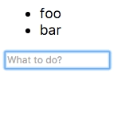

[custom-elements]: https://developer.mozilla.org/en-US/docs/Web/Web_Components/Custom_Elements
[demo-url]: https://rafaelrinaldi.github.io/data-components
[dist-url]: https://rawgit.com/rafaelrinaldi/data-components/master/dist/index.min.js
[first-draft]: https://gist.github.com/rafaelrinaldi/cf0c3851070cd935ef55
[module]: https://github.com/fnando/module
[piecemaker]: https://github.com/jcemer/piecemaker
[spa]: https://en.wikipedia.org/wiki/Single-page_application
[url]: http://rinaldi.io

# data-components [](/FAQ.md#what-does-unstable-mean-)

> Tiny component structure for web applications

## Install

```sh
$ npm install data-components --save
```

<sup>Or you can simply copy and paste the [minified standalone version that lives under `dist/`][dist-url]</sup>

## Motivation

There are plenty of options to architect a web application out there but most options often assume that you're working on a [SPA][spa]. That alone will add a lot of stuff that you might not want at all. Data binding, custom messaging system and virtual DOM to name a few.

Sometimes you just need something simple to kick things off without having to worry about naming conventions and programming paradigms. That's how this library was born.

## Usage

Let's implement the simplest todo list app.

```html
<!-- Create our todo list element passing some initial values -->
<ul data-component="todo" data-values="foo,bar"></ul>

<!-- Let's use a input field to read the user input -->
<input data-component="input" placeholder="What to do?">
```

Ok, now that we have our markup in place, let's implement the application.

```js
// Todo component
function Todo(el, options) {
  this.el = el;
  // Read from initial values
  this.todos = options.values.split(',');
  this.render();
}

// Add items to the todos list
Todo.prototype.add = function (todo) {
  this.todos.push(todo);
  this.render();
};

// Render the todos list to the DOM
Todo.prototype.render = function () {
  this.el.innerHTML = this.todos.map(function (todo) {
    return '<li>' + todo + '</li>';
  }).join('');
};

// User input component
function Input(el, options, sandbox) {
  var todo = sandbox.get('todo');

  el.focus();
  el.addEventListener('keydown', function(e) {
    // Submit value to "todo" component when hitting the enter key
    if (e.keyCode === 13) {
      todo.add(this.value);
      this.value = '';
      this.focus();
    }
  });
}

// Bootstrap components
components({
  todo: Todo,
  input: Input
});
```



It works with just a few lines of code :tada:

[Check out the demo page][demo-url] for a slightly more complex example.

---

### Bootstrap

One of the greatest advantages behind following a component structure is that you have zero context awareness. Having to manually bootstrap modules on different pages of a project is error-prone, not productive and can often cause trouble (e.g: renaming a component then having to change all the references to it all across the project).

On your application entry point, simply call the component bootstrap function. Here we're saving a reference on the global scope so we can later reference it:

```js
const components = require('data-components');

// Create a `UI` namespace and expose it globally
window.UI = components();
```

### Component structure

It uses data attributes to identify components and their options. Here's an example:

```html
<ul data-component="list" data-toggle="click">
  <li>Do the laundry</li>
  <li>Finish homework</li>
  <li>Buy spaghetti and tomato sauce</li>
</ul>
```

Notice that you specify a component name via `data-component`. This way it'll know this component must be mounted.

Now you need an implementation for your component:

```js
class List {
  constructor(node, options, sandbox) {
    console.log(`Bootstrapping list that toggle its visibility on "${options.toggle}" event`);
  }
};
```

It's that simple. On the "constructor" you'll receive a reference for the component markup and its options (passed along as data attributes).

### Messaging

Since all components receive a reference for their own sandbox, you can use it to make components talk to each other:

```js
class Beep {
  constructor(node, options, sandbox) {
    sandbox.get('bop').greet('Hello from beep!');
  }
}

class Bop {
  constructor(node, options, sandbox) {
    sandbox.get('beep').greet('Hello from bop!');
  }
}

const UI = components({
  'beep': Beep,
  'bop': Bop
});

//=> Hello from beep!
//=> Hello from bop!
```

Maybe in the future we can think of adding a pub/sub mechanism but from whay I have used so far the current approach got me covered.

### Registering components

There are two ways of registering components:

```js
// Import all components
const List = require('./components/list');
const Dropdown = require('./components/dropdown');
const Table = require('./components/table');

// While bootstraping them
const UI = components({
  'list': List,
  'dropdown': Dropdown
});

// On runtime (lazy loading)
UI.set('table', Table);
```

If you choose to register a component via `set()` it'll automatically perform a lookup on the current context and see if there's need to bootstrap the newly registered component.

### Accessing components

Every time a component is mounted, it'll save the instance to its own sandbox. In our case this sandbox is the value of `window.UI`.

To access a component, use the `get()` method exposed by the sandbox:

```js
UI.get('list'); //=> List {}
```

### Custom exports

Often you use the same component multiple times under the same context and that's when custom exports come in handy. Simple specify `data-exports` and it will use it to store the component instance into its unique reference.

Using our previous example, imagine that we have two different lists but both share the same component implementation:

```html
<ul data-component="list" data-exports="home">
  <li>Do the laundry</li>
  <li>Buy spaghetti and tomato sauce</li>
</ul>

<ul data-component="list" data-exports="school">
  <li>Finish homework</li>
</ul>
```

Now you have a unique identifier for both components:

```js
// Tasks under "home" list
UI.get('home'); //=> List {}

// Tasks under "school" list
UI.get('school'); //=> List {}
```

### Final thoughts

This is obviously no wildcard and really there are better options out there if you're working on a SPA, but it sure helps to keep an organized codebase.

Ideally [Custom Elements][custom-elements] would solve this in a very elegant way but I haven't found any solution that don't rely either on hacky implementation or a giant runtime (looking at you Polymer).

I started playing with this idea [a while ago][first-draft] and I'm already successfully using it in two production projects (with more than two developers besides myself).

## FAQ

Before creating an issue, please make sure you read the [FAQ](/FAQ.md) first.

## Related

Other great options available that I have personally tried in the past and kinda share the same ideas behind this project:

* [Module][module]
* [Piecemaker][piecemaker]
* [Custom Elements][custom-elements]

## License

MIT © [Rafael Rinaldi][url]
